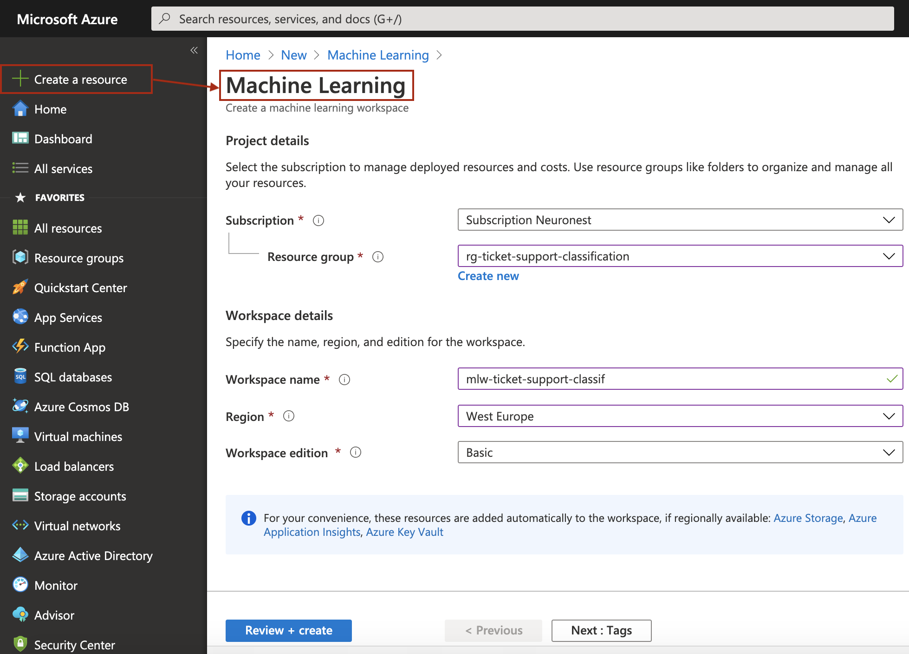
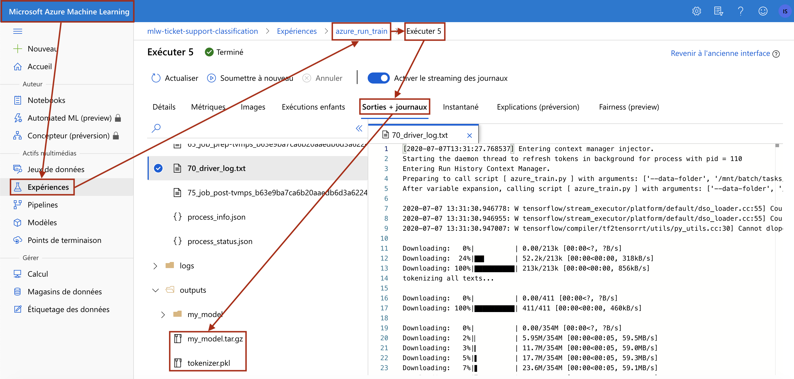

# Support ticket classification

## Article

This project has also been discussed, in a more schematic way, [in an article on our website](https://neuronest.net/attribution-des-tickets-aux-equipes-it/).

## Documentation

**Support Ticket Classification** is a Data Science project which goal is 
to correctly classify IT support tickets. 

It is a real world problem and the type of solution that is presented here aims
 at saving time in handling production issues by the IT teams.
 
The data is Microsoft support ticket dataset.

The data comes in two versions in this project:
- The first one, ```all_tickets.csv```, has about 50.000 samples and 13 **unbalanced** distinct tickets categories.
- The second one, ```subset_tickets.csv```, has about 3.000 samples and 5 **balanced** distinct tickets categories.

This repository allows you to:
- Get the data
- Train the model to classify tickets, either locally or in Azure cloud
- Deploy the model on an Azure Webapp and expose it through a REST API

## Requirements
 
 - [Miniconda](https://docs.conda.io/en/latest/miniconda.html) to create 
 and activate the right python environment
 

## Installation
 
 ```console
 $ source install.sh
 ```
 
## Get the data

 ```console
 $ python download_data.py
 
 ---> all_tickets.csv and subset_tickets.csv at project root level
 ```
 
## Train locally on your machine

There are default values in ```src/train_conf.yml``` that drive the training.

You may update them, most important field to fill is ```dataset_path```:
```
training:
  ...

data:
  dataset_path: all_tickets.csv
  ...
```
Default path is ```all_tickets.csv```

Now run training:
 ```console
 $ python src/train.py
 
 ---> my_model folder and tokenizer.pkl at project root level
 ```
 - ```my_model``` contains the model description and weights
 - ```tokenizer.pkl``` is the text model tokenizer that goes hand in hand with the model  


## Or train in Azure cloud

First there are a few steps that you must undertake to train in Azure:
1) Create an Azure ```resource group``` associated to the project
2) Create a ```Machine Learning Workspace``` associated to the ```resource group``` that contains what we need to train
 

Go to [Azure portal](https://portal.azure.com/)

Create a resource of type ```resource group``` and fill in these 
types of settings
 


Your ```Subscription``` name and ```Region``` may be different of course

Next create a resource of type ```Machine Learning```, this is your ```Machine Learning Workspace```



Same as before, your ```Subscription``` name and ```Region``` may be different.

Go into your ```Machine Learning Workspace``` and create there the compute 
resource we will use to train.


Next step is to send the data to an Azure data folder. 

To do it we need to set a few Azure settings at ```src/azure_conf.yml```

```
LOCAL_DATASET_PATH: "all_tickets.csv"
SUBSCRIPTION_ID: "<subscription_id>"
...

STORAGE:
  AccountName: "<account_name>"
  AccountKey: "<account_key>"
  ...
...
```
- ```LOCAL_DATASET_PATH```: the path to the csv dataset you want to send to Azure
- ```SUBSCRIPTION_ID``` and ```STORAGE``` info is found at:

more precisely, ```<account_name>``` and ```<account_key>``` can be found at:


Send the data to Azure
 ```console
 $ python src/azure_store_data.py
 
 ---> all_tickets.csv or subset_tickets.csv sent to your Azure data folder
 ```
 
Now run the training in Azure:
 ```console
 $ python src/azure_run_train.py
 ```
 
Download your **trained model** and **tokenizer** from Azure:
- Go into your ```Machine Learning Workspace``` and launch 
```Azure Machine Learning Studio```
- Download the files you need at:


 Move ```my_model.tar.gz``` and ```tokenizer.pkl``` to project root, 
 extract ```my_model.tar.gz```
 
 You should have ```my_model``` folder and ```tokenizer.pkl``` 
 at project root.
 
## Build the project Docker image and push to Docker Hub

Go to [Docker Hub](https://hub.docker.com/repositories)

- Create a private repository ```ticket_support_classification```

In the following we assume that your Docker Hub user name is ```yohskua```

**You must replace it by your own Docker Hub user name**

- Build the project Docker image
 ```console
 $ docker build -t yohskua/ticket_support_classification
 ```
 
 - Push the image to your Docker Hub private repository
 ```console
 $ docker push yohskua/ticket_support_classification:latest
 ```

## Deploy project on Azure WebApp

Create a resource of type ```Web App``` and fill in these 
types of settings:


Next fill in your Docker Hub private repository settings:


Go in your Web App ```app-ticket-classification``` resource

Finally add an environment variable that Azure will use:

  
 
Azure uses this variable so that Docker publishes this container port to the host machine. 

This container port is the one used by the FastAPI server inside the container.

Try and run this example to see if the Web App is correctly deployed
 
 ```python
from post_request import post_classify_ticket
message = "monitor add install new monitor,monitor hello dear had monitor discussed he told leave tower give thank"
post_classify_ticket(message, url="https://app-ticket-classification.azurewebsites.net")
 
  ---> {
    "ticket_message": "monitor add install new monitor,monitor hello dear had monitor discussed he told leave tower give thank",
    "ticket_category": 5
}
 ```
 


